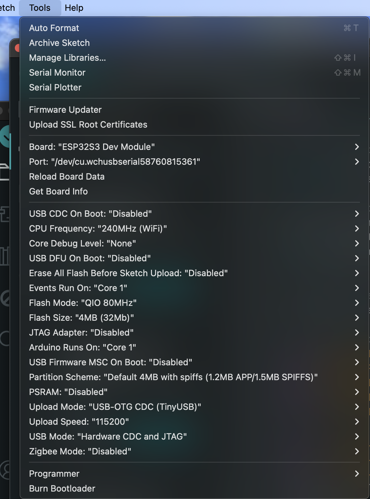
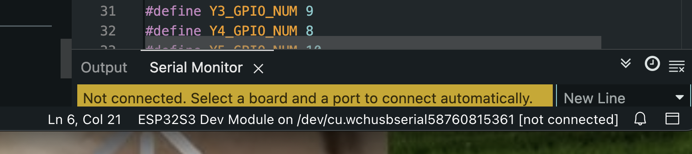
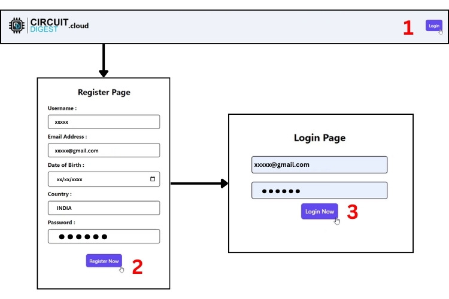
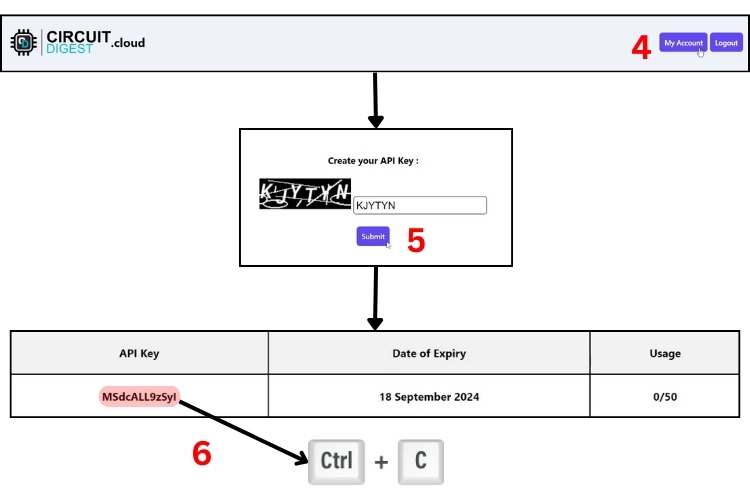

# Smart Parking System – IoT Implementation

## Overview

This project implements a **Smart Parking System** using an ESP32-S3 development board, various IoT sensors/actuators, and an edge server running a Python-based web interface. It demonstrates real-time car detection, license plate recognition, gate automation, slot monitoring, and database interaction.

This system was developed as an **individual project** for the SWE30011 unit, and received full marks for functionality, complexity, and integration.  
▶️ [**Video Demonstration**](https://www.youtube.com/watch?v=-jaxCG_dILg)

---

## Table of Contents

- [Project Features](#project-features)  
- [Hardware & Components](#hardware--components)  
- [Arduino Environment Setup](#arduino-environment-setup)  
- [Libraries Required (ESP32)](#libraries-required-esp32)  
- [Pin Mapping Reference](#pin-mapping-reference)  
- [CircuitDigest API Key Setup](#circuitdigest-api-key-setup)  
- [index.html Usage](#indexhtml-usage)  
- [Python Web App Setup](#python-web-app-setup)  
- [Database Configuration](#database-configuration)  
- [References](#references)  
- [Author](#author)  

---

## Project Features

- 2-slot parking area with IR car detection  
- Camera-based license plate recognition  
- Automatic gate control using servo motor  
- Visual feedback via green/red LEDs and buzzer  
- Slot availability displayed on I2C LCD  
- Real-time communication between ESP32 and Python via Serial  
- MariaDB-backed reservation system with plate validation  
- Web interface for booking, cancelling, and monitoring slots  

---

## Hardware & Components

- ESP32-S3 Dev Module  
- I2C 16x2 LCD Display  
- Servo Motor  
- IR Sensors (3 total: 1 gate, 2 for slots)  
- 2x Red LEDs, 2x Green LEDs  
- 1x Buzzer  
- Power Supply, Breadboard, Jumper Wires  
- ESP32-S3 onboard camera  

---

## Arduino Environment Setup

1. Install **Arduino IDE** (1.8+ or 2.x).  
2. In Arduino IDE:  
   - Go to `Tools > Board > ESP32S3 Dev Module`  
   - Select correct COM Port  

3. Match the configuration:  
   - Board: "ESP32S3 Dev Module"  
   - CPU Freq: 240MHz  
   - Flash Size: 4MB (32Mb)  
   - Upload Mode: USB-OTG CDC  
   - Upload Speed: 115200  
   - PSRAM: Disabled  

**Board Configuration Screenshot:**  


4. Use Serial Monitor to debug.  
   To find the correct **serial port**, look at the **bottom-right corner** of the Arduino IDE interface.  
   It will display the active COM port (e.g., `COM3` on Windows or `/dev/cu.wchusbserial*` on Linux/macOS).

**Example (Bottom-Right in Arduino IDE):**  


---

### ⚠️ macOS Technical Notes (Troubleshooting)

If you're using **macOS**, you may encounter issues detecting the ESP32-S3 board due to missing USB drivers.

#### CH34x USB Driver Installation

Many ESP32-S3 boards use the **CH34x** USB-to-Serial chip. To enable serial communication:

1. Connect your ESP32-S3 board via USB.
2. Download the CH34x driver from WCH:
   [https://www.wch-ic.com/downloads/CH34XSER_MAC_ZIP.html](https://www.wch-ic.com/downloads/CH34XSER_MAC_ZIP.html)
3. Install `CH34xVCPDriver.pkg`.
4. If macOS blocks the driver:
   - Go to **System Preferences > Security & Privacy**
   - Click **"Allow"** next to the blocked system extension.
5. For macOS Sequoia 15.0.1 and above:
   - Go to **System Settings > General > Login Items > Extensions**
   - Enable the CH34x driver manually.

#### Verifying the Serial Port

To confirm that the board is detected:

```bash
ls /dev/cu.wchusbserial*
```

You should see something like:

```bash
/dev/cu.wchusbserial123456
```

Use that exact port in Arduino IDE when selecting your board’s COM port.

---

## Libraries Required (ESP32)

Ensure the following libraries are installed in Arduino IDE:

```cpp
#include <Arduino.h>
#include <WiFi.h>
#include <WiFiClientSecure.h>
#include "esp_camera.h"
#include <NTPClient.h>
#include <WiFiUdp.h>
#include <ESP32Servo.h>
#include <ArduinoJson.h>
```

Install them via **Tools > Manage Libraries** in Arduino IDE.

---

## Pin Mapping Reference

Use accurate pin configuration for ESP32-S3 using the Freenove reference:  
[Freenove ESP32-S3 Ultimate Starter Kit](https://github.com/Freenove/Freenove_Ultimate_Starter_Kit_for_ESP32)

---

## CircuitDigest API Key Setup

The ESP32 uses CircuitDigest Cloud API for license plate recognition.

### To generate the API key:
1. Visit: https://circuitdigest.cloud  
2. Register and log in  
3. Go to `My Account`, complete captcha  
4. Click to generate API Key  
5. Copy the API key  

**Generating API Key – Step A:**  


**Generating API Key – Step B:**  


### Replace in Code:
- Open all related code files  
- Search for `"YOURAPIKEY"` using `Ctrl + F` or `Cmd + F`  
- Replace with the actual key  

---

## index.html Usage

The file `index.html` must be placed inside a folder named `templates/` to work with Flask.

This is required because Flask uses the Jinja templating engine which only renders `.html` files stored in the `templates/` folder using `render_template()`.

---

## Python Web App Setup

### 1. Install Required Python Libraries

```bash
pip install flask
pip install pyserial
pip install mysql-connector-python
pip install flask-cors
```

If needed, use `pip3` instead of `pip`.

### 2. Run the App

```bash
python parking.py
```

The Flask server will run on `http://localhost:8080` with a dashboard for live monitoring, control, and bookings.

---

## Database Configuration

This project uses **MariaDB** to manage parking slots, plate recognition history, and system logs.
All necessary tables are created automatically when the Python backend (`parking.py`) is first run.

### Tables Created

- **`slots`**  
  Stores information about the parking slots:
  - `id` (INT, PRIMARY KEY)
  - `status` (VARCHAR): either `'free'` or `'booked'`
  - `plate` (VARCHAR): assigned license plate (nullable)

- **`plates`**  
  Stores detected license plate logs:
  - `id` (AUTO_INCREMENT, PRIMARY KEY)
  - `plate_number` (VARCHAR): detected plate
  - `timestamp` (DATETIME): detection time
  - `slot_assigned` (INT): optional link to a slot
  - `status` (VARCHAR): status label (e.g., `'detected'`, `'wrong_slot'`, etc.)

- **`system_logs`**  
  Tracks events from the system:
  - `id` (AUTO_INCREMENT, PRIMARY KEY)
  - `event_type` (VARCHAR): type of system event
  - `event_data` (TEXT): optional event details
  - `timestamp` (DATETIME): when the event occurred

### Initial Data

On the first run, the system checks and ensures at least **2 parking slots** are initialized as free:

```sql
INSERT INTO slots (id, status) VALUES (1, 'free');
INSERT INTO slots (id, status) VALUES (2, 'free');
```

> ✅ Make sure your MariaDB service is running, and that the database credentials in `parking.py` (`DB_CONFIG`) are configured to match your local setup.

```python
DB_CONFIG = {
    "host": "localhost",
    "user": "root",
    "password": "",
    "database": "smart_parking"
}
```

---

## References

This project was built with reference to:

- Freenove ESP32-S3 Starter Kit: https://github.com/Freenove/Freenove_Ultimate_Starter_Kit_for_ESP32  
- CircuitDigest Cloud API: https://circuitdigest.cloud  
- Flask Framework: https://flask.palletsprojects.com  
- Random Nerd Tutorials: https://randomnerdtutorials.com  
- Swinburne Lecture Materials & Sample Codes  
- Full reference list available in `individual_iot_project.pdf`

---

## Author

**Duong Ha Tien Le (@hteng05)**  
Swinburne University of Technology  
Bachelor of Computer Science  
Unit: SWE30011 – Internet of Things Programming (2025, Semester 1)
